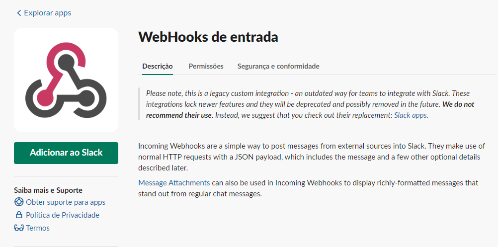
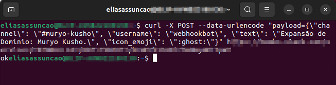
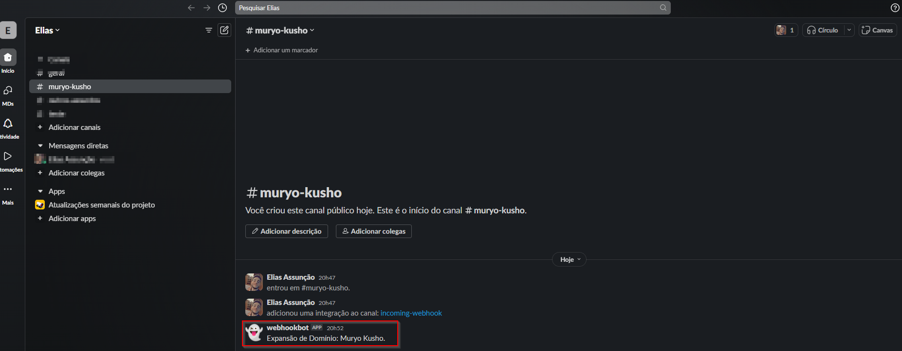

# Integrando Grafana e alertas com o Slack


**Objetivo**:

O objetivo deste projeto é aprimorar os recursos de monitoramento e alerta do sistema por meio da otimização dos dashboards do Grafana, da configuração dos alertas no Alertmanager e da integração dessas funcionalidades com o Slack. A melhoria desses aspectos visa fornecer uma solução mais eficiente para o acompanhamento em tempo real do desempenho do sistema, permitindo que a equipe receba notificações pertinentes de forma proativa, em vez de depender exclusivamente da observação contínua dos dashboards. Este projeto é uma continuação de iniciativas anteriores e busca aperfeiçoar ainda mais a infraestrutura de monitoramento e resposta a incidentes, visando garantir a estabilidade e a confiabilidade contínuas dos serviços oferecidos.

## 📌 Requisitos

* [Projeto Anterior](https://github.com/Hooligam/Monitoramento-Prometheus)

* Ambiente de Desenvolvimento Integrado (IDE):Recomenda-se o uso do Eclipse devido à sua integração nativa com o Maven, o que simplifica o processo de gerenciamento de dependências.

* Docker e Docker-Compose: Essas ferramentas fornecem uma maneira consistente e eficiente de empacotar, distribuir e executar a aplicação em diferentes ambientes.

* Java JDK 1.8.0_312: O ambiente de desenvolvimento requer o Java Development Kit (JDK) versão 1.8.0_312 ou superior. Esta versão específica do JDK foi selecionada devido à compatibilidade com as dependências e bibliotecas utilizadas no projeto.

* Maven: O Maven é uma ferramenta de automação de compilação amplamente utilizada no ecossistema Java. Ele é usado para gerenciar dependências, compilar o código-fonte, executar testes e criar artefatos de distribuição da aplicação. É fundamental que o Maven esteja instalado e configurado corretamente no ambiente de desenvolvimento.

* Slack: Criar uma conta e ter um workspace


## 📦 Documentação

**Configuração do WebHook do Slack**

Para integrar o sistema de alertas com o Slack, iremos utilizar WebHooks de entrada



Para testar o WebHook, vamos utilizar o nosso terminal e usar um curl simples.



Se tudo estiver corretamente configurado, vamos receber o seguinte resultado no slack



**Configurando Alertmanager / Integração**

O Alertmanager é responsável por gerenciar e enviar alertas. Vamos criar um arquivo de configuração YAML para que o Alertmanager envie alertas para o Slack via WebHook.


**Inicialização dos Contêineres do Projeto**

Para iniciar os contêineres do projeto, utilize o seguinte comando:
```
docker-compose up -d
```

**Alertas**

Apos subir os containers e acessar o Prometheus, vamos conseguir visualizar os alertas configurados


**Simulação de Erros**

Para testar a resiliência do sistema e verificar a eficácia dos alertas, realizaremos uma simulação de erros, derrubando propositalmente dois contêineres do projeto: o do banco de dados (db) e o do registro (regis).


Ao derrubar esses contêineres, criaremos uma série de eventos de falha que serão capturados pelo sistema de monitoramento e refletidos nos dashboards do Grafana. Além disso, o Alertmanager será acionado para enviar alertas para o Slack, notificando a equipe sobre as falhas detectadas.

Este procedimento nos permitirá avaliar a capacidade do sistema de detectar e responder a eventos adversos, bem como a eficácia dos mecanismos de alerta implementados.


Conseguimos visualizar a mudança de status dos alertas


**Alertas no Slack**

Após a ocorrência de condições que acionam os alertas configurados, os membros da equipe receberão notificações no Slack.
É importante destacar que, durante situações de alerta contínuo, como durante a simulação de erros mencionada anteriormente, as mensagens de alerta continuarão a ser enviadas ao canal especificado no Slack. No entanto, os membros da equipe têm a opção de silenciar notificações específicas utilizando as configurações do Alertmanager.


**Alertas de Problema Resolvido:**

AApós análise e resolução do possível problema que causou os alertas, os membros da equipe receberão uma notificação indicando que o problema foi resolvido. Essa notificação será enviada ao canal especificado no Slack e informará que os serviços afetados foram normalizados.


**🔥 Conclusão 🔥**

As principais realizações incluem:

*Integração com o Slack:* Implementação bem-sucedida do WebHook do Slack para receber notificações de alerta diretamente no canal especificado.

*Configuração do Alertmanager:* Desenvolvimento de um arquivo de configuração YAML para o Alertmanager, permitindo o envio automático de alertas para o Slack em resposta a eventos de interesse.

*Simulação de Erros:* Realização de uma simulação controlada de falhas para testar a capacidade do sistema de detectar e responder a eventos adversos, garantindo sua resiliência e confiabilidade.

*Gerenciamento de Alertas:* Estabelecimento de procedimentos para gerenciamento eficaz de alertas, incluindo a opção de silenciar notificações repetitivas e receber notificações de resolução de problemas.


Essas melhorias contribuem significativamente para a capacidade de monitoramento e resposta a incidentes do sistema, promovendo a estabilidade contínua e garantindo a entrega consistente de serviços de alta qualidade.

⌨️ com ❤️ por [Elias Assunção](https://github.com/Hooligam) 🔥

